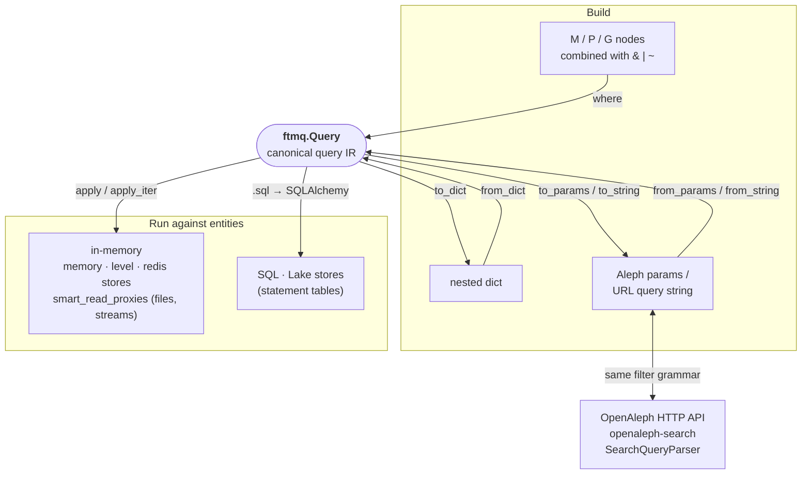

One of the main features of `ftmq` is a high-level query interface for [Follow The Money](https://followthemoney.tech) data stored in a file, a stream, or a statement-based store powered by [nomenklatura](https://github.com/opensanctions/nomenklatura).

A `Query` is a composable, backend-agnostic filter over FtM entities. It is also the *canonical query representation* used across `ftmq`: the same object can be evaluated in memory, translated to SQL, or converted to and from the [Aleph / OpenAleph](https://openaleph.org) URL-param grammar.

## Where `Query` sits in the toolchain

`Query` is the hub. It is built from `M` / `P` / `G` nodes (or deserialized from a dict or from Aleph params), and from there it is either run against entities or projected back out to another representation.



Because the Aleph param grammar is shared, the *same* query language works in both directions: an Aleph-style request can drive an `ftmq` store, and an `ftmq` `Query` can drive the OpenAleph API. This is what lets `Query` eventually underpin openaleph-search's `SearchQueryParser`.

## Building a query

A query is built from three node constructors, split by the statement-table column they target:

| Node | Targets | Use it for |
|---|---|---|
| **`M`** (meta) | `dataset`, `schema`, `origin`, entity `id` | `M(schema="Person")`, `M(dataset__in=["d1", "d2"])` |
| **`P`** (property) | a specific FtM property | `P(name="Jane")`, `P(amountEur__gte=1000)` |
| **`G`** (group) | a property-*type* group (`prop_type`) | `G(countries="de")`, `G(dates__gte="2020")` |

```python
from ftmq import Query, M, P, G

q = Query().where(M(schema="Person"), P(name="Jane"))
```

`M` covers the metadata fields: `dataset`, `schema` / `schemata` (see below), `origin`, and `id` / `entity_id` / `canonical_id`.

`P` matches a single, named property (example: [Person](https://followthemoney.tech/explorer/schemata/Person/)). `G` matches *any* property of a followthemoney [property type](https://followthemoney.tech/explorer/types), keyed by its group name (`names`, `dates`, `countries`, `emails`, `entities`, ...). For example `P(country="de")` matches the literal `country` property, while `G(countries="de")` matches any country-typed property (`nationality`, `jurisdiction`, `country`, ...).

### `schema` vs `schemata`

`M(schema=...)` is an **exact** match, while `M(schemata=...)` matches an entity that **is-a** the given schema (the schema itself or any of its descendants):

```python
Query().where(M(schema="LegalEntity"))     # only entities whose schema is exactly LegalEntity
Query().where(M(schemata="LegalEntity"))   # LegalEntity, Company, Organization, Person, PublicBody, ...
Query().where(M(schema__in=["Person", "Company"]))   # exactly those two
```

### Combining conditions

Nodes compose into arbitrary boolean trees with `&` (and), `|` (or) and `~` (not):

```python
~M(schema="Organization")                              # NOT
P(name="Jane") | P(name__ilike="j%")                   # OR
M(schema="Person") & (G(countries="de") | G(countries="at"))   # nested
```

[`Query.where`][ftmq.Query.where] takes any number of nodes and combines them with **and**. Chained `.where()` calls also combine with **and**:

```python
q = Query().where(M(schema="Payment"), P(date__gte="2024-10"))
q = q.where(G(countries="de") | G(countries="at"))
```

Structurally equivalent queries (built in a different order) serialize and hash identically.

### Value comparators

Any lookup can carry a comparator with the `__<comparator>` suffix (default is equals):

- `eq` (default) / `not` - (not) equals
- `gt` / `gte` / `lt` / `lte` - greater / lower (or equal)
- `in` / `not_in` - value (not) in a list
- `like` / `ilike` - SQLish `LIKE` / case-insensitive `ILIKE` (use `%` placeholders)
- `startswith` / `endswith`
- `null` - test for presence: `P(deathDate__null=True)` matches entities *without* a `deathDate`

```python
# Payments >= 1000 EUR, in October 2024
Query().where(M(schema="Payment"), P(amountEur__gte=1000), P(date__gte="2024-10"), P(date__lt="2024-11"))

# All Janes and Joes
Query().where(P(firstName__in=["Jane", "Joe"]))

# Exclude a legal form
Query().where(~P(legalForm="gGmbH"))
```

### Reverse lookups (edges)

There is no dedicated reverse operator: a reverse lookup is just a filter on an entity-typed value.

```python
G(entities="entity-id")     # any entity-typed property pointing at this id (any edge)
P(director="entity-id")     # a specific edge property pointing at this id
```

### Sorting and slicing

```python
q = Query().order_by("name")                 # ascending
q = Query().order_by("date", ascending=False)

q = Query()[:100]     # first 100
q = q[10:20]          # next 10
q = q[1]              # the 2nd result (0-indexed)
```

Aggregations are documented on the [aggregation](./aggregation.md) page.

## Running a query

Filter a stream of entities with [`apply`][ftmq.Query.apply] / [`apply_iter`][ftmq.Query.apply_iter], or pass the query to [`smart_read_proxies`][ftmq.io.smart_read_proxies]:

```python
from ftmq import Query, M
from ftmq.io import smart_read_proxies

q = Query().where(M(dataset="my_dataset"), M(schema="Event"))

for proxy in smart_read_proxies("s3://data/entities.ftm.json", query=q):
    assert proxy.schema.name == "Event"
```

Or use a [store view](./stores.md):

```python
from ftmq.store import get_store

store = get_store("sqlite:///followthemoney.store")
view = store.default_view()

for proxy in view.query(q):
    ...
```

!!! warning "SQL / Lake stores: flat queries only (for now)"
    In-memory stores (memory, level, redis, file streams) evaluate arbitrary
    `& | ~` trees. The SQL / Lake translation
    ([`query.sql`][ftmq.Query.sql]) currently supports only flat conjunctions
    (`and` of conditions); cross-field `OR` and negated groups are in-memory
    only until the SQL layer is migrated.

## Serialization and the Aleph bridge

`Query` has three serialization surfaces. All three round-trip.

Lossless nested tree (any query), for caching and storage:

```python
data = q.to_dict()
assert Query.from_dict(data).to_dict() == data
```

Aleph params, as a `MultiDict` or as a URL query string:

```python
q = Query().where(M(schema="Person"), G(countries="de"))
q.to_string()   # "filter:countries=de&filter:schema=Person"
Query.from_string("filter:schema=Person&filter:countries=de")
Query.from_params({"filter:schema": ["Person"], "filter:countries": ["de"]})
```

The bridge maps `ftmq` nodes onto the Aleph `filter:` / `exclude:` / `empty:` convention:

| Aleph param | ftmq node |
|---|---|
| `filter:schema=Person` / `filter:schemata=LegalEntity` | `M(schema=...)` / `M(schemata=...)` |
| `filter:dataset=d` / `filter:collection_id=d` | `M(dataset="d")` |
| `filter:id=x` / `filter:_id=x` | `M(id="x")` |
| `filter:properties.firstName=Jane` | `P(firstName="Jane")` |
| `filter:countries=de` (any group) | `G(countries="de")` |
| `filter:gte:properties.date=2018` | `P(date__gte=2018)` |
| `exclude:properties.country=ru` | `P(country__not="ru")` |
| `empty:properties.birthDate` | `P(birthDate__null=True)` |

The param grammar is flat, so [`to_params`][ftmq.Query.to_params] /
[`to_string`][ftmq.Query.to_string] raise
[`QueryError`][ftmq.QueryError] for a query that cannot be expressed as flat
Aleph params (a cross-field `OR` or a negated group). [`from_params`][ftmq.Query.from_params]
/ [`from_string`][ftmq.Query.from_string] are total.

!!! note "Result fidelity"
    The query *language* round-trips in all directions. Exact *result-set*
    equivalence between the Elasticsearch backend and an `ftmq` statement store
    is best-effort for analyzed fields (e.g. `ilike` uses SQL `%` wildcards vs
    ES analyzers; the `names` group is name-normalized in ES). Aleph free-text
    search (`q` / `prefix`) has no `ftmq` equivalent.

## Reference

[Full reference][ftmq.Query]
