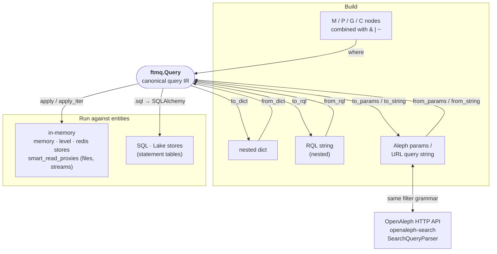

One of the main features of `ftmq` is a high-level query interface for [Follow The Money](https://followthemoney.tech) data stored in a file, a stream, or a statement-based store powered by [nomenklatura](https://github.com/opensanctions/nomenklatura).

A `Query` is a composable, backend-agnostic filter over FtM entities. It is also the *canonical query representation* used across `ftmq`: the same object can be evaluated in memory, translated to SQL, or converted to and from the [Aleph / OpenAleph](https://openaleph.org) URL-param grammar.

## Where `Query` sits in the toolchain

`Query` is the hub. It is built from `M` / `P` / `G` / `C` nodes (or deserialized from a dict or from Aleph params), and from there it is either run against entities or projected back out to another representation.


```mermaid
flowchart TD
    subgraph build [Build]
        NODES["M / P / G / C nodes<br/>combined with &amp; | ~"]
        DICT["nested dict"]
        RQL["RQL string<br/>(nested)"]
        PARAMS["Aleph params /<br/>URL query string"]
    end

    Q(["<b>ftmq.Query</b><br/>canonical query IR"])

    NODES -->|where| Q
    DICT -->|from_dict| Q
    Q -->|to_dict| DICT
    RQL -->|from_rql| Q
    Q -->|to_rql| RQL
    PARAMS -->|from_params / from_string| Q
    Q -->|to_params / to_string| PARAMS

    subgraph run [Run against entities]
        MEM["in-memory<br/>memory · level · redis stores<br/>smart_read_proxies (files, streams)"]
        SQLB["SQL · Lake stores<br/>(statement tables)"]
    end

    Q -->|apply / apply_iter| MEM
    Q -->|.sql → SQLAlchemy| SQLB

    PARAMS <-->|same filter grammar| ALEPH["OpenAleph HTTP API<br/>openaleph-search<br/>SearchQueryParser"]
```

The param grammar works in both directions: an Aleph-style request can drive an `ftmq` store, and an `ftmq` `Query` can drive the OpenAleph API.

## Building a query

A query is built from four node constructors, split by the statement-table column they target:

| Node | Targets | Use it for |
|---|---|---|
| **`M`** (meta) | `dataset`, `schema` / `schemata`, entity ids | `M(schema="Person")`, `M(dataset__in=["d1", "d2"])` |
| **`P`** (property) | a specific FtM property | `P(name="Jane")`, `P(amountEur__gte=1000)` |
| **`G`** (group) | a property-*type* group (`prop_type`) | `G(countries="de")`, `G(dates__gte="2020")` |
| **`C`** (context) | a context / storage column | `C(origin="crawl")`, `C(first_seen__gte="2024-01")` |

```python
from ftmq import Query, M, P, G, C

q = Query().where(M(schema="Person"), P(name="Jane"))
```

`M` covers the metadata fields: `dataset`, `schema` / `schemata` (see below), and `id` / `entity_id` / `canonical_id`.

`P` matches a single, named property (example: [Person](https://followthemoney.tech/explorer/schemata/Person/)). `G` matches *any* property of a followthemoney [property type](https://followthemoney.tech/explorer/types), keyed by its group name (`names`, `dates`, `countries`, `emails`, `entities`, ...). For example `P(country="de")` matches the literal `country` property, while `G(countries="de")` matches any country-typed property (`nationality`, `jurisdiction`, `country`, ...).

`C` matches a context / storage column: `origin`, plus whatever extra columns a backend carries (`fragment`, `first_seen`, `bucket`, ...). Any key is accepted at build time; in memory it reads `entity.context[key]`, in SQL it maps to the same-named statement-table column and an unknown column raises [`QueryError`][ftmq.QueryError] at compile time. On the wire a context field spells `context.<name>` (`filter:context.origin=crawl`).

### `schema` vs `schemata`

`M(schema=...)` is an **exact** match, while `M(schemata=...)` matches an entity that **is-a** the given schema (the schema itself or any of its descendants):

```python
Query().where(M(schema="LegalEntity"))     # only entities whose schema is exactly LegalEntity
Query().where(M(schemata="LegalEntity"))   # LegalEntity, Company, Organization, Person, PublicBody, ...
Query().where(M(schema__in=["Person", "Company"]))   # exactly those two
```

### Combining conditions

Nodes compose into arbitrary boolean trees with `&` (and), `|` (or) and `~` (not):

```python
~M(schema="Organization")                              # NOT
P(name="Jane") | P(name__ilike="j%")                   # OR
M(schema="Person") & (G(countries="de") | G(countries="at"))   # nested
```

[`Query.where`][ftmq.Query.where] takes any number of nodes and combines them with **and**. Chained `.where()` calls also combine with **and**:

```python
q = Query().where(M(schema="Payment"), P(date__gte="2024-10"))
q = q.where(G(countries="de") | G(countries="at"))
```

Structurally equivalent queries (built in a different order) serialize and hash identically.

Nodes are canonicalized as they combine: a sub-group of the same connector merges into its parent, and a condition that appears twice (passed twice, or re-applied in a chained `.where()`) is held once. `Query(P(name="x"), P(name="x"))` is `Query(P(name="x"))` on every surface - serialization, hash and the compiled SQL alike.

### What AND means

An entity is a set of statements, so a condition on it is really "some statement of this entity says so". That leaves a question for every conjunction: does each condition get its own statement, or do they have to agree on one? ftmq answers it the same way in memory and in SQL:

> **Conditions that could hold of one statement simultaneously must hold of the same one.**

| conditions | share a statement | why |
|---|---|---|
| distinct row-scoped columns - `C(origin="crawl") & C(first_seen__gte=d)`, `M(dataset="a") & C(origin="crawl")` | **yes** | different columns of one statement |
| bounds on one field - `P(date__gte="2024-10") & P(date__lt="2024-11")` | **yes** | a lower and an upper bound describe one value |
| repeated equality - `M(dataset="d1") & M(dataset="d2")`, `P(name="a") & P(name="b")` | no | set semantics: "has each". `M(dataset="d1") & M(dataset="d2")` still means "present in both datasets" |
| different properties - `P(amountEur__gte=1000) & P(country="de")` | no | a statement carries exactly one property |
| `schema` / `schemata` / `id` / `canonical_id` | no | entity-wide facts. An entity merged across datasets can carry `LegalEntity` statements *and* `Person` ones, so `C(origin="x") & M(schema="Person")` stays "a Person having an x-origin statement" |

So `P(date__gte="2024-10") & P(date__lt="2024-11")` is one date inside October 2024, not one date after it plus another before December. Only conjunctions join: under `|` the alternatives stay independent, and `~` negates the joined condition ("no statement is both").

This narrows which *entities* match; it never narrows what comes back. A matching entity is still assembled from all of its statements, including those from other origins - see [`select`](#selecting-properties) to narrow that, and [`row_statements`][ftmq.query.sql.Sql.row_statements] to read only the matching rows.

!!! note "Two known gaps"
    Co-reference between *distinct* row-scoped columns needs the statements themselves. Every store-backed entity carries them, so SQL and memory agree; an entity read off a json stream has only an aggregated context (`origin` a set of origins, `first_seen` the earliest), where the correlation between two columns is already lost - there each condition is tested on its own. Everything else in the table behaves identically everywhere.

    `M(entity_id=...)` is not row-scoped: in SQL it reads the pre-resolution column, in memory the entity's own id, and co-referring it would widen that existing divergence.


### Value comparators

Any lookup can carry a comparator with the `__<comparator>` suffix (default is equals):

- `eq` (default) / `not` - (not) equals
- `gt` / `gte` / `lt` / `lte` - greater / lower (or equal)
- `in` / `not_in` - value (not) in a list
- `like` / `ilike` - (case-insensitive) substring match; `notlike` / `notilike` negate it. `%` and `_` in the value match literally
- `startswith` / `endswith`
- `null` - test for presence: `P(deathDate__null=True)` matches entities *without* a `deathDate`

```python
# Payments >= 1000 EUR, in October 2024. The two `date` bounds describe one
# date - see [What AND means](#what-and-means)
Query().where(M(schema="Payment"), P(amountEur__gte=1000), P(date__gte="2024-10"), P(date__lt="2024-11"))

# All Janes and Joes
Query().where(P(firstName__in=["Jane", "Joe"]))

# Exclude a legal form
Query().where(~P(legalForm="gGmbH"))
```

### Reverse lookups (edges)

A reverse lookup is a filter on an entity-typed value:

```python
G(entities="entity-id")     # any entity-typed property pointing at this id (any edge)
P(director="entity-id")     # a specific edge property pointing at this id
```

### Sorting and slicing

Sorting takes a single field:

```python
q = Query().order_by("name")                 # ascending
q = Query().order_by("date", ascending=False)
q = Query().order_by("-date")                # leading `-` = descending

q = Query()[:100]     # first 100
q = q[10:20]          # next 10
q = q[1]              # the 2nd result (0-indexed)
```

### Selecting properties

[`select`][ftmq.Query.select] narrows the properties a matching entity is read with. It is a projection, not a filter: it never changes *which* entities match, only how much of each comes back.

```python
q = Query().where(M(schemata="Document")).select(P("title"), P("fileName"))
```

On a statement backend this compiles to a `prop` predicate on the statement fetch, so a query for a document's title does not drag its `bodyText` across the wire; in memory the assembled entity is pruned to the same fields. Both give the same result. It takes the same `P` / `G` references an [aggregation](./aggregation.md) does - `G("countries")` keeps every country-typed property - and on the wire it spells `select=properties.title` (RQL: `select(properties.title)`).

A matching entity always comes back, even with none of the selected properties set, so a projection cannot silently drop a match. What it does cost is completeness: a projected entity has a degraded `caption` and incomplete edges, and filters, sorting and aggregations still read the full entity. It is a view of an entity, not the entity.

Aggregations are documented on the [aggregation](./aggregation.md) page.

## Running a query

Filter a stream of entities with [`apply`][ftmq.Query.apply] / [`apply_iter`][ftmq.Query.apply_iter], or pass the query to [`smart_read_proxies`][ftmq.io.smart_read_proxies]:

```python
from ftmq import Query, M
from ftmq.io import smart_read_proxies

q = Query().where(M(dataset="my_dataset"), M(schema="Event"))

for proxy in smart_read_proxies("s3://data/entities.ftm.json", query=q):
    assert proxy.schema.name == "Event"
```

Or use a [store view](./stores.md):

```python
from ftmq.store import get_store

store = get_store("sqlite:///followthemoney.store")
view = store.default_view()

for proxy in view.query(q):
    ...
```

!!! note "SQL / Lake stores: how the boolean tree compiles"
    The SQL / Lake translation ([`query.sql`][ftmq.Query.sql]) compiles arbitrary `& | ~` trees and follows the in-memory evaluator. A plain conjunction of distinct fields becomes flat `WHERE` predicates; property and group conditions, and any tree involving `OR`, negation or repeated fields, lift each condition to an entity-level `canonical_id IN (...)` sub-select. Co-referring conditions share one sub-select rather than getting one each (see [What AND means](#what-and-means)). Chained same-field filters AND (as in memory); spell alternatives as `P(name__in=[...])` or `P(name="a") | P(name="b")`. A [`select`](#selecting-properties) projection is a row predicate on the statement fetch only - it never reaches the sub-selects, `count` or the aggregations.

    Caveats: `like` on SQLite is case-insensitive for ASCII (SQLite's `LIKE` collation), unlike the in-memory and DuckDB substring test. A query of *only* meta / context fields (`M(dataset=...), M(schema=...)`) filters statement rows directly, so a canonical entity merged across datasets can match in memory but not in SQL; with any property / group condition (or a store view's scope) involved, the whole canonical entity comes back.

    Numeric aggregations (`sum` / `min` / `max` / `avg`) read the text `value` column as a number with an error-tolerant cast, so a stored value that isn't a number reads as `NULL` and drops out of the aggregate instead of failing the query - the same value is skipped in memory, where `registry.number.to_number` returns `None`. A store holding display-formatted amounts (`"324,687.00"`) therefore aggregates them as `NULL` rather than as the number they display; migrate it with `ftmq statements cast-types` so the SQL backends see the canonical format.

## Serialization

`Query` serializes to a lossless nested dict (round-trips any query), plus two URL-friendly string grammars: RQL (nested) and the flat OpenAleph params (interop).

Lossless nested tree (any query), for caching and storage:

```python
data = q.to_dict()
assert Query.from_dict(data).to_dict() == data
```

### RQL

[RQL](https://github.com/pjwerneck/pyrql) (Resource Query Language) is a compact, URL-friendly string of nestable operators - `and()` / `or()` / `not()` around comparisons - carrying an **arbitrarily nested** `& | ~` tree in a single string. [`from_rql`][ftmq.Query.from_rql] parses it and [`to_rql`][ftmq.Query.to_rql] emits it (via the `pyrql` dependency):

```python
q = Query().where(M(schema="Person") & (P(name="jane") | G(countries="de")))
q.to_rql()   # "and(eq(schema,Person),or(eq(properties.name,jane),eq(group.countries,de)))"
Query.from_rql(q.to_rql()).to_dict() == q.to_dict()   # True
```

Field names use the wire spelling shared by every string surface (params, RQL, [aggregations](./aggregation.md)): `properties.<name>` for a property, `group.<name>` for a property-type group, `context.<name>` for a context column; meta fields (`schema`, `dataset`, `id`, ...) and `year` are bare. A bare name that is none of those is read as a property. Comparison operators map to ftmq comparators (`eq`, `ne` → `not`, `lt` / `le` / `gt` / `ge`, `in`, `out` → `not_in`, `like` / `ilike`).

| RQL | ftmq node |
|---|---|
| `eq(schema,Person)` / `eq(schemata,LegalEntity)` | `M(schema=...)` / `M(schemata=...)` |
| `eq(dataset,d)` | `M(dataset="d")` |
| `eq(id,x)` | `M(id="x")` |
| `eq(properties.firstName,Jane)` | `P(firstName="Jane")` |
| `eq(group.countries,de)` (any group) | `G(countries="de")` |
| `eq(context.origin,crawl)` | `C(origin="crawl")` |
| `ge(properties.date,2018)` | `P(date__gte=2018)` |
| `ne(properties.country,ru)` | `P(country__not="ru")` |
| `in(properties.name,(Jane,Joe))` | `P(name__in=["Jane", "Joe"])` |
| `ilike(properties.name,jan)` | `P(name__ilike="jan")` |
| `and(ge(properties.date,2024-10),lt(properties.date,2024-11))` | `P(date__gte="2024-10") & P(date__lt="2024-11")` (one date, see [What AND means](#what-and-means)) |
| `and(eq(schema,Person),or(eq(group.countries,de),eq(group.countries,at)))` | `M(schema="Person") & (G(countries="de") \| G(countries="at"))` |
| `not(and(eq(properties.name,Jane),eq(group.countries,de)))` | `~(P(name="Jane") & G(countries="de"))` |
| `count(id)` | `A(count=M("id"))` |
| `aggregate(properties.beneficiary,sum(properties.amountEur))` | `A(sum=P("amountEur"), by=P("beneficiary"))` |
| `aggregate(year,sum(properties.amountEur))` | `A(sum=P("amountEur"), by=Year())` |
| `select(properties.title,properties.fileName)` | `.select(P("title"), P("fileName"))` |

The last four rows are not filters: RQL carries [aggregations](./aggregation.md) and the [`select`](#selecting-properties) projection in the same string, side by side with the filter under the top-level `and` (`and(eq(schema,Payment),aggregate(properties.beneficiary,sum(properties.amountEur)))`).

`to_rql` raises [`QueryError`][ftmq.QueryError] for a comparator with no RQL equivalent (`null`, `startswith`, `endswith`, `notlike`, `notilike`); unlike the flat param grammar it never raises for the *shape* of a tree.

### OpenAleph

URL params (as [OpenAleph](https://openaleph.org) uses them), as a `MultiDict` or as a URL query string:

```python
q = Query().where(M(schema="Person"), G(countries="de"))
q.to_string()   # "filter:group.countries=de&filter:schema=Person"
Query.from_string("filter:schema=Person&filter:group.countries=de")
Query.from_params({"filter:schema": ["Person"], "filter:group.countries": ["de"]})
```

The bridge maps `ftmq` nodes onto the Aleph `filter:` / `exclude:` / `empty:` convention:

| Aleph param | ftmq node |
|---|---|
| `filter:schema=Person` / `filter:schemata=LegalEntity` | `M(schema=...)` / `M(schemata=...)` |
| `filter:dataset=d` / `filter:collection_id=d` | `M(dataset="d")` |
| `filter:id=x` / `filter:_id=x` | `M(id="x")` |
| `filter:properties.firstName=Jane` | `P(firstName="Jane")` |
| `filter:group.countries=de` (any group) | `G(countries="de")` |
| `filter:gte:properties.date=2018` | `P(date__gte=2018)` |
| `exclude:properties.country=ru` | `P(country__not="ru")` |
| `empty:properties.birthDate` | `P(birthDate__null=True)` |
| `select=properties.title` | `.select(P("title"))` (a [projection](#selecting-properties), not a filter) |

The param grammar is flat, so [`to_params`][ftmq.Query.to_params] / [`to_string`][ftmq.Query.to_string] raise [`QueryError`][ftmq.QueryError] for a query that cannot be expressed as flat Aleph params (a cross-field `OR` or a negated group). [`from_params`][ftmq.Query.from_params] / [`from_string`][ftmq.Query.from_string] are total.

!!! note "Result fidelity"
    The query *language* round-trips in all directions. Exact *result-set* equivalence between the Elasticsearch backend and an `ftmq` statement store is best-effort for analyzed fields (e.g. `ilike` uses SQL `%` wildcards vs ES analyzers; the `names` group is name-normalized in ES). Aleph free-text search (`q` / `prefix`) has no `ftmq` equivalent.

## Reference

[Full reference][ftmq.Query]
