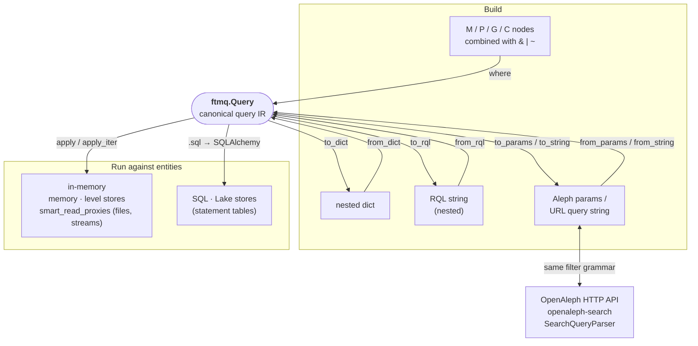

A `Query` is a composable, backend-agnostic filter over [Follow The Money](https://followthemoney.tech) entities in a file, a stream or a [nomenklatura](https://github.com/opensanctions/nomenklatura) statement store. The same object runs in memory, compiles to SQL, and converts to and from the [Aleph / OpenAleph](https://openaleph.org) URL params.

## Where `Query` sits in the toolchain


```mermaid
flowchart TD
    subgraph build [Build]
        NODES["M / P / G / C nodes<br/>combined with &amp; | ~"]
        DICT["nested dict"]
        RQL["RQL string<br/>(nested)"]
        PARAMS["Aleph params /<br/>URL query string"]
    end

    Q(["<b>ftmq.Query</b><br/>canonical query IR"])

    NODES -->|where| Q
    DICT -->|from_dict| Q
    Q -->|to_dict| DICT
    RQL -->|from_rql| Q
    Q -->|to_rql| RQL
    PARAMS -->|from_params / from_string| Q
    Q -->|to_params / to_string| PARAMS

    subgraph run [Run against entities]
        MEM["in-memory<br/>memory · level stores<br/>smart_read_proxies (files, streams)"]
        SQLB["SQL · Lake stores<br/>(statement tables)"]
    end

    Q -->|apply / apply_iter| MEM
    Q -->|.sql → SQLAlchemy| SQLB

    PARAMS <-->|same filter grammar| ALEPH["OpenAleph HTTP API<br/>openaleph-search<br/>SearchQueryParser"]
```

## Building a query

A query is built from four node constructors, split by the statement-table column they target:

| Node | Targets | Use it for |
|---|---|---|
| **`M`** (meta) | `dataset`, `schema` / `schemata`, `id` / `entity_id` / `canonical_id` | `M(schema="Person")`, `M(dataset__in=["d1", "d2"])` |
| **`P`** (property) | a specific FtM property | `P(name="Jane")`, `P(amountEur__gte=1000)` |
| **`G`** (group) | a property-*type* group (`prop_type`) | `G(countries="de")`, `G(dates__gte="2020")` |
| **`C`** (context) | a context / storage column | `C(origin="crawl")`, `C(first_seen__gte="2024-01")` |

```python
from ftmq import Query, M, P, G, C

q = Query().where(M(schema="Person"), P(name="Jane"))
```

`P(country="de")` matches the literal `country` [property](https://followthemoney.tech/explorer/schemata/Person/), while `G(countries="de")` matches any property of that [type](https://followthemoney.tech/explorer/types) (`nationality`, `jurisdiction`, `country`, ...). Groups are keyed by name: `names`, `dates`, `countries`, `emails`, `entities`, ...

`C` accepts any key (`origin`, plus backend columns such as `fragment`, `first_seen`, `bucket`). In memory it reads `entity.context[key]`; in SQL the same-named statement column, where an unknown column raises [`QueryError`][ftmq.QueryError] at compile time. Its wire spelling is `context.<name>` (`filter:context.origin=crawl`).

### `schema` vs `schemata`

`M(schema=...)` is an **exact** match, `M(schemata=...)` an **is-a** match (the schema or any descendant):

```python
Query().where(M(schema="LegalEntity"))     # only entities whose schema is exactly LegalEntity
Query().where(M(schemata="LegalEntity"))   # LegalEntity, Company, Organization, Person, PublicBody, ...
Query().where(M(schema__in=["Person", "Company"]))   # exactly those two
```

### Combining conditions

Nodes compose into arbitrary boolean trees with `&` (and), `|` (or) and `~` (not):

```python
~M(schema="Organization")                              # NOT
P(name="Jane") | P(name__ilike="j%")                   # OR
M(schema="Person") & (G(countries="de") | G(countries="at"))   # nested
```

[`Query.where`][ftmq.Query.where] combines its nodes with **and**, as do chained `.where()` calls:

```python
q = Query().where(M(schema="Payment"), P(date__gte="2024-10"))
q = q.where(G(countries="de") | G(countries="at"))
```

Trees are canonicalized as they combine (nested same-connector groups merge, duplicate conditions drop), so equivalent queries serialize, hash and compile identically.

### What AND means

A condition holds if some statement of the entity satisfies it. In a conjunction:

> **Conditions that could hold of one statement simultaneously must hold of the same one.**

| conditions | share a statement | why |
|---|---|---|
| distinct row-scoped columns - `C(origin="crawl") & C(first_seen__gte=d)`, `M(dataset="a") & C(origin="crawl")` | **yes** | different columns of one statement |
| bounds on one field - `P(date__gte="2024-10") & P(date__lt="2024-11")` | **yes** | the bounds describe one value |
| repeated equality - `M(dataset="d1") & M(dataset="d2")`, `P(name="a") & P(name="b")` | no | set semantics: "has each", e.g. present in both datasets |
| different properties - `P(amountEur__gte=1000) & P(country="de")` | no | a statement carries one property |
| `schema` / `schemata` / `id` / `canonical_id` | no | entity-wide: `C(origin="x") & M(schema="Person")` is "a Person with an x-origin statement" |

So `P(date__gte="2024-10") & P(date__lt="2024-11")` is one date in October 2024. Only conjunctions join: alternatives under `|` stay independent, and `~` negates the joined condition ("no statement is both").

This decides which entities match, not what comes back: a matching entity is assembled from all of its statements (narrow that with [`select`](#selecting-properties)).

!!! note "Two known gaps"
    Co-reference between *distinct* row-scoped columns needs the statements. An entity read off a json stream only has an aggregated context (`origin` a set, `first_seen` the earliest), so there each condition is tested on its own.

    `M(entity_id=...)` is not row-scoped: SQL reads the pre-resolution column, memory the entity's own id.

### Value comparators

Any lookup takes a `__<comparator>` suffix (default equals):

- `eq` (default) / `not` - (not) equals
- `gt` / `gte` / `lt` / `lte` - greater / lower (or equal)
- `in` / `not_in` - value (not) in a list
- `like` / `ilike` - (case-insensitive) substring match; `notlike` / `notilike` negate it. `%` and `_` in the value match literally
- `startswith` / `endswith`
- `null` - presence: `P(deathDate__null=True)` matches entities *without* a `deathDate`

```python
# payments >= 1000 EUR in October 2024 (one date, see What AND means)
Query().where(M(schema="Payment"), P(amountEur__gte=1000), P(date__gte="2024-10"), P(date__lt="2024-11"))

# all Janes and Joes
Query().where(P(firstName__in=["Jane", "Joe"]))

# exclude a legal form
Query().where(~P(legalForm="gGmbH"))
```

### Reverse lookups (edges)

A reverse lookup is a filter on an entity-typed value:

```python
G(entities="entity-id")     # any entity-typed property pointing at this id (any edge)
P(director="entity-id")     # a specific edge property pointing at this id
```

### Sorting and slicing

Sorting takes a single property reference:

```python
q = Query().order_by(P("name"))                     # ascending
q = Query().order_by(P("date"), ascending=False)    # descending

q = Query()[:100]     # first 100
q = q[10:20]          # next 10
q = q[1]              # the 2nd result (0-indexed)
```

Any other reference (`M("id")`, `G("dates")`, ...), a bare string or an unknown property raises a `QueryError`. Wire spelling: `sort=properties.name:desc` in URL params, `"order_by": "-properties.name"` in [`to_dict`][ftmq.Query.to_dict]. Entities without the sort property come last in either direction; ties and unsorted slices are ordered by entity id, so `limit` / `offset` paging is stable.

### Selecting properties

[`select`][ftmq.Query.select] restricts which properties a matching entity is read with. It never changes which entities match.

```python
q = Query().where(M(schemata="Document")).select(P("title"), P("fileName"))
```

It takes `P` / `G` references (`G("countries")` keeps every country-typed property); wire spelling `select=properties.title`, RQL `select(properties.title)`. On a statement backend it filters the statement fetch, so a document's `bodyText` is not fetched; in memory the entity is pruned to the same fields.

A matching entity always comes back, even with none of the selected properties set. A projected entity has a degraded `caption` and incomplete edges; filters, sorting and aggregations still see the full entity.

Aggregations are documented on the [aggregation](./aggregation.md) page.

## Running a query

Filter a stream of entities with [`apply`][ftmq.Query.apply] / [`apply_iter`][ftmq.Query.apply_iter], or pass the query to [`smart_read_proxies`][ftmq.io.smart_read_proxies]:

```python
from ftmq import Query, M
from ftmq.io import smart_read_proxies

q = Query().where(M(dataset="my_dataset"), M(schema="Event"))

for proxy in smart_read_proxies("s3://data/entities.ftm.json", query=q):
    assert proxy.schema.name == "Event"
```

Or use a [store view](./stores.md):

```python
from ftmq.store import get_store

store = get_store("sqlite:///followthemoney.store")
view = store.default_view()

for proxy in view.query(q):
    ...
```

!!! note "SQL / Lake stores"
    The SQL translation ([`query.sql`][ftmq.Query.sql]) compiles arbitrary `& | ~` trees with the in-memory semantics. Every condition becomes an entity-level `canonical_id IN (...)` sub-select (co-referring conditions share one, see [What AND means](#what-and-means)), so whole canonical entities come back. Chained same-field filters AND; spell alternatives as `P(name__in=[...])` or `P(name="a") | P(name="b")`. A [`select`](#selecting-properties) projection only restricts the statement fetch, never the sub-selects, `count` or the aggregations.

    On SQLite, `like` is case-insensitive for ASCII (SQLite's `LIKE` collation), unlike in memory and on DuckDB.

    Numeric aggregations and sorting read the text `value` column with an error-tolerant cast: a value that isn't a number reads as `NULL` and is skipped, as in memory. Display-formatted amounts (`"324,687.00"`) read as `NULL` too; migrate such a store with `ftmq statements cast-types`.

## Serialization

`Query` serializes to a lossless nested dict, an RQL string (nested trees) and flat OpenAleph params.

```python
data = q.to_dict()
assert Query.from_dict(data).to_dict() == data
```

### RQL

[RQL](https://github.com/pjwerneck/pyrql) carries an arbitrarily nested `& | ~` tree in one URL-friendly string (`and()` / `or()` / `not()` around comparisons). Parse with [`from_rql`][ftmq.Query.from_rql], emit with [`to_rql`][ftmq.Query.to_rql]:

```python
q = Query().where(M(schema="Person") & (P(name="jane") | G(countries="de")))
q.to_rql()   # "and(eq(schema,Person),or(eq(properties.name,jane),eq(group.countries,de)))"
Query.from_rql(q.to_rql()).to_dict() == q.to_dict()   # True
```

Fields use the wire spelling shared by every string surface: `properties.<name>`, `group.<name>`, `context.<name>`; meta fields (`schema`, `dataset`, `id`, ...) and `year` are bare. Any other bare name is read as a property. Comparators: `eq`, `ne` → `not`, `lt` / `le` / `gt` / `ge`, `in`, `out` → `not_in`, `like` / `ilike`.

| RQL | ftmq node |
|---|---|
| `eq(schema,Person)` / `eq(schemata,LegalEntity)` | `M(schema=...)` / `M(schemata=...)` |
| `eq(dataset,d)` | `M(dataset="d")` |
| `eq(id,x)` | `M(id="x")` |
| `eq(properties.firstName,Jane)` | `P(firstName="Jane")` |
| `eq(group.countries,de)` (any group) | `G(countries="de")` |
| `eq(context.origin,crawl)` | `C(origin="crawl")` |
| `ge(properties.date,2018)` | `P(date__gte=2018)` |
| `ne(properties.country,ru)` | `P(country__not="ru")` |
| `in(properties.name,(Jane,Joe))` | `P(name__in=["Jane", "Joe"])` |
| `ilike(properties.name,jan)` | `P(name__ilike="jan")` |
| `and(ge(properties.date,2024-10),lt(properties.date,2024-11))` | `P(date__gte="2024-10") & P(date__lt="2024-11")` (one date, see [What AND means](#what-and-means)) |
| `and(eq(schema,Person),or(eq(group.countries,de),eq(group.countries,at)))` | `M(schema="Person") & (G(countries="de") \| G(countries="at"))` |
| `not(and(eq(properties.name,Jane),eq(group.countries,de)))` | `~(P(name="Jane") & G(countries="de"))` |
| `count(id)` | `A(count=M("id"))` |
| `aggregate(properties.beneficiary,sum(properties.amountEur))` | `A(sum=P("amountEur"), by=P("beneficiary"))` |
| `aggregate(year,sum(properties.amountEur))` | `A(sum=P("amountEur"), by=Year())` |
| `select(properties.title,properties.fileName)` | `.select(P("title"), P("fileName"))` |

The last four rows are [aggregations](./aggregation.md) and the [`select`](#selecting-properties) projection, placed next to the filter under the top-level `and`: `and(eq(schema,Payment),aggregate(properties.beneficiary,sum(properties.amountEur)))`.

`to_rql` raises [`QueryError`][ftmq.QueryError] for a comparator with no RQL equivalent (`null`, `startswith`, `endswith`, `notlike`, `notilike`), never for the shape of a tree.

### OpenAleph

[OpenAleph](https://openaleph.org) URL params, as a `MultiDict` or a query string:

```python
q = Query().where(M(schema="Person"), G(countries="de"))
q.to_string()   # "filter:group.countries=de&filter:schema=Person"
Query.from_string("filter:schema=Person&filter:group.countries=de")
Query.from_params({"filter:schema": ["Person"], "filter:group.countries": ["de"]})
```

| Aleph param | ftmq node |
|---|---|
| `filter:schema=Person` / `filter:schemata=LegalEntity` | `M(schema=...)` / `M(schemata=...)` |
| `filter:dataset=d` / `filter:collection_id=d` | `M(dataset="d")` |
| `filter:id=x` / `filter:_id=x` | `M(id="x")` |
| `filter:properties.firstName=Jane` | `P(firstName="Jane")` |
| `filter:group.countries=de` (any group) | `G(countries="de")` |
| `filter:gte:properties.date=2018` | `P(date__gte=2018)` |
| `exclude:properties.country=ru` | `~P(country="ru")` |
| `empty:properties.birthDate` | `P(birthDate__null=True)` |
| `select=properties.title` | `.select(P("title"))` (a [projection](#selecting-properties), not a filter) |

`exclude:` negates the matching `filter:` (Aleph's `must_not`): `exclude:properties.country=ru` keeps every entity not holding `ru`, including those without a `country`; a repeated key negates the `in` list. `P(country__not="ru")` ("holds a country other than `ru`") has no param spelling; in RQL it is `ne(...)` (`not_in` is `out(...)`).

The param grammar is flat: [`to_params`][ftmq.Query.to_params] / [`to_string`][ftmq.Query.to_string] raise [`QueryError`][ftmq.QueryError] for a cross-field `OR` or a negated group. [`from_params`][ftmq.Query.from_params] / [`from_string`][ftmq.Query.from_string] accept every param combination.

!!! note "Result fidelity"
    The query language round-trips in all directions, but result sets from the OpenAleph Elasticsearch backend and an `ftmq` store can differ on analyzed fields (`ilike` vs ES analyzers, the name-normalized `names` group). Aleph free-text search (`q` / `prefix`) has no `Query` equivalent.

## Reference

[Full reference][ftmq.Query]
